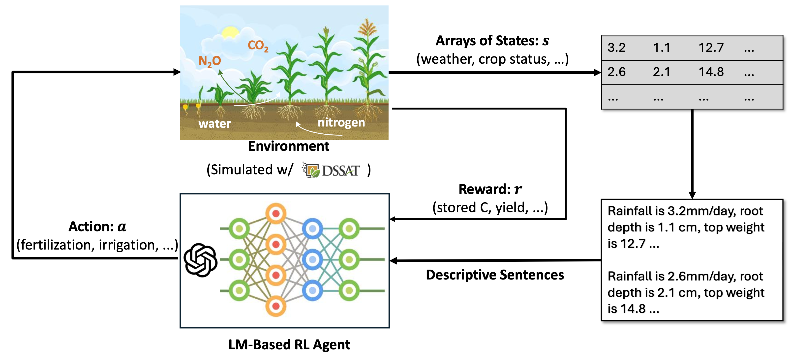
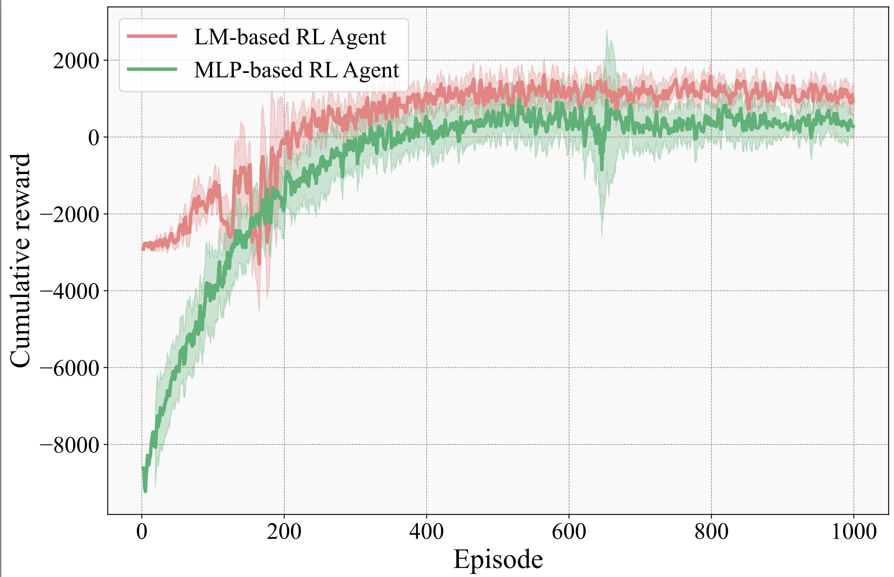

# LLM_RL_AG

# Table of Contents:

1. [Introduction](#introduction)
2. [Repo Structure](#Repo-Structure)
3. [Setup](#Setup)
4. [Change Location](#Change-Location)
5. [Update Training Policy](#Update-Training-Policy)
6. [Model Zoo](#model-zoo)
7. [Reward Comparison](#Reward-Comparison)
8. [Citing the paper](#citing-the-paper)
9. [Citing this repo](#citing-this-repo)

# Introduction
Crop management plays a crucial role in determining crop yield, economic profitability, and environmental sustainability. Despite the availability of management guidelines, optimizing these practices remains a complex and multifaceted challenge. In response, previous studies have explored using reinforcement learning with crop simulators, typically employing simple neural-network-based reinforcement learning (RL) agents. Building on this foundation, this paper introduces a more advanced intelligent crop management system. This system uniquely combines RL, a language model (LM), and crop simulations facilitated by the Decision Support System for Agrotechnology Transfer (DSSAT). We utilize deep RL, specifically a deep Q-network, to train management policies that process numerous state variables from the simulator as observations. A novel aspect of our approach is the conversion of these state variables into more informative language, facilitating the language model's capacity to understand states and explore optimal management practices. The empirical results reveal that the LM exhibits superior learning capabilities. Through simulation experiments with maize crops in Florida (US) and Zaragoza (Spain), the LM not only achieves state-of-the-art performance under various evaluation metrics but also demonstrates a remarkable improvement of over 49\% in economic profit, coupled with reduced environmental impact when compared to baseline methods.

  

# Repo Structure

The repo structure is attached. The files with (G) mean that they will be generated during model training. 

<pre>
- mlp_agent
    |-mlp256_batch1024_tau30_update4_lr5.ipynb
    |-checkpoint(G)
        |-model1114.pth(G)
    |-log(G)
        |-dssat-pdi.log(G)
    |-llm512_256_batch512_tau8_update16_lr5_irr6_clip_aug_train.pdf(G)
    |-llm512_256_batch512_tau8_update16_lr5_irr6_clip_aug_train.xlsx(G)

- llm_agent
    |-llm512_256_batch512_tau8_update16_lr5_irr6_clip_aug.ipynb
    |-checkpoint(G)
        |-model1114.pth(G)
    |-log(G)
        |-dssat-pdi.log(G)
    |-llm512_256_batch512_tau8_update16_lr5_irr6_clip_aug_train.pdf(G)
    |-llm512_256_batch512_tau8_update16_lr5_irr6_clip_aug_train.xlsx(G)
</pre>

# Setup

First, install gym-dssat
Reference: https://rgautron.gitlabpages.inria.fr/gym-dssat-docs/Installation/packages.html

Second, install conda environment of python 11 and install dependencies  
```
source /opt/gym_dssat_pdi/bin/activate
pip install pandas tqdm torch openai python-dotenv matplotlib gym ipython pyarrow ipykernel transformers
```

Third, install kernal for Jupyter Notebook 
```
python -m ipykernel install --user --name=gym_dssat_pdi --display-name="Gym DSSAT PDI"
```

# Change Location
You can test different locations, such as Spain. Please follow the steps: 

First, Download the config file SIAZ9501.MZX to the place jupyter notebook located
   
Second, Setup the envs
```
env_args = {
    'run_dssat_location': '/opt/dssat_pdi/run_dssat',  # assuming (modified) DSSAT has been installed in /opt/dssat_pdi
    'log_saving_path': './logs/dssat-pdi.log',  # if you want to save DSSAT outputs for inspection
    # 'mode': 'irrigation',  # you can choose one of those 3 modes
    # 'mode': 'fertilization',
    'mode': 'all',
    'seed': 123456,
    'random_weather': False,  # if you want stochastic weather
    'fileX_template_path':'./SIAZ9501.MZX',
    #'experiment_number':1
}
env = gym.make('gym_dssat_pdi:GymDssatPdi-v0', **env_args)
print('Observation:',env.observation,)
print(len(env.observation),len(env.observation['sw']))
ram_dimensions = len(env.observation)+len(env.observation['sw'])-1
```

# Update Training Policy
You can easily update the training policy by changing the k1/k2/k3/k4 in the 'dqn' func.


# Model Zoo
(To update)

# Reward Comparison
  

# Citing the paper 
(To add)

```

```

# Citing this repo 
(To add)
If you use the repo in your own studies, and work, please cite it by using the following:

```

```


# TODOs:
   
1. Paper writing, Plots, Experiments (CVPRW)
   
2. Add partial cases (AAAI)

3. Refactor the code

